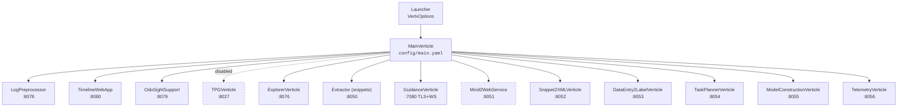
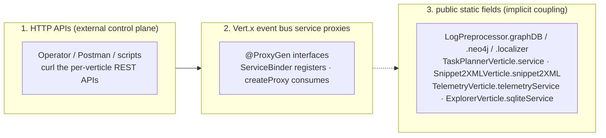
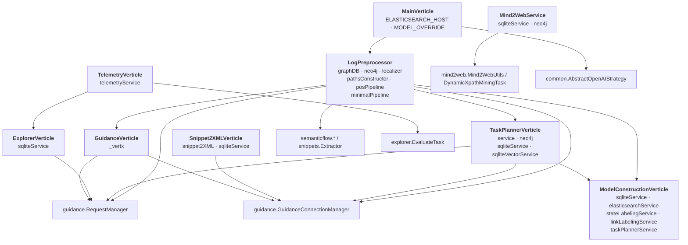
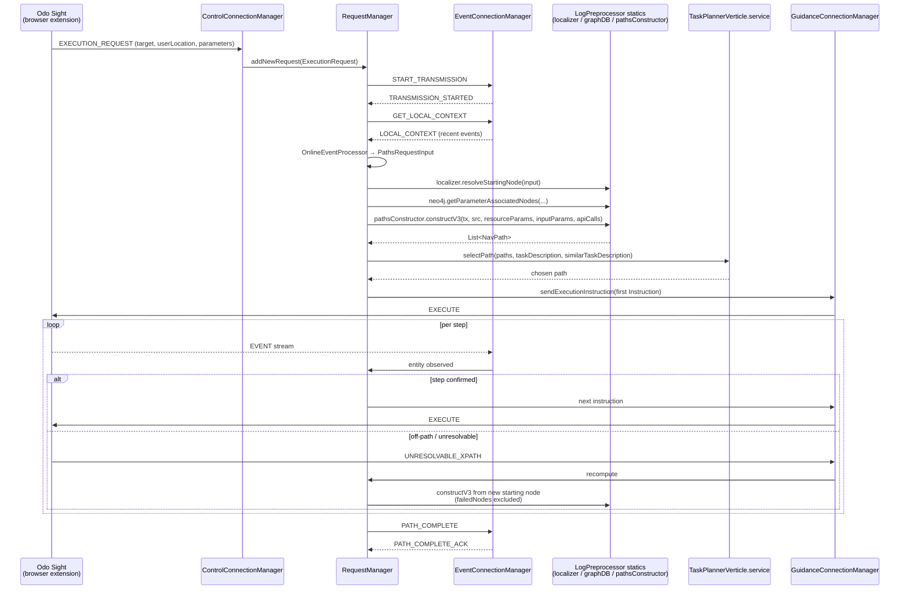
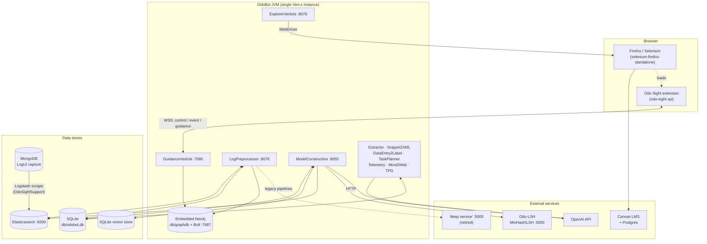

# OdoBot Architecture Manifest

> **Status:** Living document. Generated by reading the source tree starting from
> `src/main/java/ca/ualberta/odobot/Launcher.java`.
> **Scope:** High-level architecture, verticle inventory, API surface, configuration,
> event-bus service proxies, and inter-verticle coupling.
> **Audience:** Anyone who needs to figure out what OdoBot actually does before changing it.

---

## 1. What OdoBot Is

OdoBot is a research prototype that learns a **navigation model** of a web application
(primarily Canvas LMS) from recorded user interaction traces, and then **replays / generalizes**
that model to execute natural-language tasks against the live application.

The system spans four broad concerns, which map roughly onto four generations of the project:

| Concern | What it does | Principal components |
|---|---|---|
| **Data capture** | Ingests interaction traces produced by the *Odo Sight* browser extension, scraped out of LogUI/MongoDB into Elasticsearch. | `OdoSightSupport`, `ElasticsearchService` |
| **Model construction** | Turns raw event logs into timelines, semantic traces, snippets, semantic schemas, and a Neo4j **navigation model**. | `LogPreprocessor` + pipelines, `Extractor`, `Snippet2XMLVerticle`, `DataEntry2LabelVerticle`, `ModelConstructionVerticle` |
| **Task execution / guidance** | Plans a path through the navigation model for a task, then drives a live browser step-by-step over WebSockets. | `GuidanceVerticle`, `TaskPlannerVerticle` |
| **Experimentation** | Generates synthetic data, generates evaluation tasks, drives Selenium, records telemetry. | `ExplorerVerticle`, `TelemetryVerticle`, `Mind2WebService`, `TPGVerticle` |

Because the project has run for several years under shifting priorities, **several components
are effectively abandoned** but still deployed. Those are flagged with a ⚠️ throughout.

---

## 2. Bootstrap

```
Launcher (io.vertx.core.Launcher subclass)
   └─ configures VertxOptions (worker pool 4, 10-minute blocked-thread / worker-execute limits)
   └─ deploys MainVerticle (declared in build.gradle shadowJar manifest)
          └─ reads config/main.yaml
          └─ conditionally deploys every other verticle
```

`Launcher.beforeStartingVertx` deliberately disables Vert.x's blocked-thread protections
(`setBlockedThreadCheckInterval(10, MINUTES)`, `setMaxEventLoopExecuteTime(10, MINUTES)`).
Much of OdoBot performs long, blocking work (Neo4j transactions, Selenium, LLM calls) directly
on event-loop or worker threads, and these settings just suppress the warnings.

`MainVerticle` is a `ConfigurableVerticle`. It:

1. Reads `config/main.yaml`.
2. Hoists two globals: `MainVerticle.ELASTICSEARCH_HOST` and `MainVerticle.MODEL_OVERRIDE`
   (a global LLM model-name override consumed by `common.AbstractOpenAIStrategy`).
3. Deploys each verticle whose boolean flag is `true` in `main.yaml`.
4. Initializes `AbstractOpenAIStrategy.activeTokenUsageRecord` — a **process-global LLM token
   counter** shared by every OpenAI-backed strategy.

### `config/main.yaml` — deployment switches

| Key | Verticle deployed | Notes |
|---|---|---|
| `LogPreProcessor` | `logpreprocessor.LogPreprocessor` | **Must be true** — owns the embedded Neo4j and registers `sqlite-service`, `elasticsearch-service`, `domsequencing-service`. |
| `TimelineWebApp` | `web.TimelineWebApp` | Read-only browsing UI over pipeline executions. |
| `OdoSightSupport` | `web.OdoSightSupport` | Endpoints called by the Odo Sight extension / scrape tooling. |
| `TPG` | `tpg.TPGVerticle` | ⚠️ Currently `false`. Tangled Program Graph learner. |
| `Explorer` | `explorer.ExplorerVerticle` | Deployed with a dedicated `explorer-pool` (8 workers, 1 h max execute). |
| `SnippetExtractor` | `snippets.Extractor` | |
| `Guidance` | `guidance.GuidanceVerticle` | Dedicated `guidance-pool` (8 workers, 1 h). |
| `Mind2Web` | `mind2web.Mind2WebService` | ⚠️ Mind2Web benchmark line of work. Dedicated `mind2web-pool`. |
| `Snippet2XML` | `snippet2xml.Snippet2XMLVerticle` | Dedicated `snippet2xml-pool`. |
| `DataEntry2Label` | `dataentry2label.DataEntry2LabelVerticle` | |
| `TaskPlanner` | `taskplanner.TaskPlannerVerticle` | Dedicated `task-planner-pool`. |
| `ModelConstruction` | `modelconstruction.ModelConstructionVerticle` | |
| `Telemetry` | `telemetry.TelemetryVerticle` | |
| `elasticsearchHost` | — | Global ES host. |
| `modelOverride` | — | Global LLM model id override. |



---

## 3. Base Abstractions

Two base classes in `ca.ualberta.odobot.common` define the shape of most verticles.

### `ConfigurableVerticle`
- Extends `io.vertx.rxjava3.core.AbstractVerticle`.
- `rxStart()` builds a `ConfigRetriever` over a single YAML file store at `configFilePath()`,
  logs every key/value, assigns the result to the protected `_config` field, then calls `onStart()`.
- **Hazard:** `rxStart()` returns `Completable.complete()` *immediately* and calls `onStart()`
  from inside the config subscription. Deployment therefore completes before the verticle is
  actually configured, so **inter-verticle initialization ordering is not guaranteed** — this is
  the root cause of most of the static-global timing fragility described in §7.

### `HttpServiceVerticle extends ConfigurableVerticle`
- Creates an `HttpServer` from `getServerOptions()` (overridable), calls `afterServerCreate()`
  (overridable — Guidance uses it to attach the WebSocket handler), then builds:
  - `mainRouter` with `LoggerHandler`, a `BodyHandler` capped at ~1 GB, and permissive CORS
    (`Access-Control-Allow-Origin: *`).
  - `api` sub-router mounted at `_config.apiPathPrefix` (default `/api/*`).
- Subclasses register routes on `api` inside their `onStart()`.

Verticles predating these base classes (`LogPreprocessor`, `TimelineWebApp`, `OdoSightSupport`,
`TPGVerticle`) extend `AbstractVerticle` directly and hard-code their host/port/prefix.

---

## 4. Communication Planes

OdoBot components talk to each other through **three** distinct mechanisms. Only the first two
are architecturally intentional.



### 4.1 Event-bus service proxy registry

All addresses are string constants in `logpreprocessor/Constants.java`.

| Address | Interface | Registered by (`ServiceBinder`) | Consumed by (`createProxy` / `ServiceProxyBuilder`) |
|---|---|---|---|
| `sqlite-service` | `sqlite.SqliteService` | `LogPreprocessor` **and** `Mind2WebService` ⚠️ (see §7.1) | `ExplorerVerticle`, `OdoSightSupport`, `ModelConstructionVerticle`, `Snippet2XMLVerticle`, `TaskPlannerVerticle`, `DataEntry2LabelVerticle`, `Extractor`, `TPGVerticle`, `AbstractPreprocessingPipeline` |
| `elasticsearch-service` | `elasticsearch.ElasticsearchService` | `LogPreprocessor` (registered with an 86 400 s timeout) | `TimelineWebApp`, `OdoSightSupport`, `DataEntry2LabelVerticle`, `ModelConstructionVerticle` (300 s), `Extractor` (1 h), `TPGVerticle`, `AbstractPreprocessingPipeline` |
| `domsequencing-service` | `domsequencing.DOMSequencingService` | `LogPreprocessor` | `TPGVerticle`, `AbstractPreprocessingPipeline` |
| `snippet-extractor-service` | `snippets.SnippetExtractorService` | `snippets.Extractor` | `LogPreprocessor` (the proxy is injected into `ElasticsearchService.create`) |
| `task-planner-service` | `taskplanner.TaskPlannerService` | `TaskPlannerVerticle` | `ExplorerVerticle` (1 h timeout), `ModelConstructionVerticle` (1 h timeout) |
| `sqlite-vector-service` | `sqlite.SqliteVectorService` | `ModelConstructionVerticle` | `TaskPlannerVerticle` |
| `snippet2xml-service` | `snippet2xml.Snippet2XMLService` | `Snippet2XMLVerticle` | *(no proxy consumers — callers use the static field instead)* |
| `dataentry2label-service` | `dataentry2label.DataEntry2LabelService` | `DataEntry2LabelVerticle` | *(no consumers)* |
| `telemetry-service` | `telemetry.TelemetryService` | `TelemetryVerticle` | *(no proxy consumers — callers use the static field instead)* |
| `tpg-service` | `tpg.service.TPGService` | `TPGVerticle` | *(no consumers)* |

**Services that look like proxies but are not:** `modelconstruction.CleanerService`,
`modelconstruction.statelabeling.StateLabelingService`, and
`modelconstruction.linklabeling.LinkLabelingService` declare `createProxy` helpers but are only
ever instantiated in-process by `ModelConstructionVerticle` via `create()`. ⚠️
`logpreprocessor.xes.XesTransformerService` is a **dead stub** — its `create()` returns `null`.

### 4.2 Raw event-bus usage

Direct `eventBus()` use is rare and follows one pattern: **Elasticsearch document streaming.**

`ElasticsearchService.processEvents(index, targetEventBusAddress)` streams every document in an
index to a caller-supplied ad-hoc address, so the caller can process events incrementally
without loading the whole index into memory.

| Producer | Consumer | Address |
|---|---|---|
| `ElasticsearchServiceImpl` (`vertx.eventBus().send(...)`) | `ModelConstructionVerticle::loadDOMSnapshots` | random `UUID` |
| `ElasticsearchServiceImpl` | `ModelConstructionVerticle::mineCommonDOMSubstructures` | `"<lshId>-hashingProcessor"` |

### 4.3 Static-global coupling map

These are **compile-time code dependencies between verticles** that bypass the event bus
entirely. They are the main obstacle to deploying OdoBot's components separately.



Read this as: *"the box's `public static` fields are dereferenced by the node it points at."*
Notably, the `guidance` runtime reaches directly into `LogPreprocessor`, `TaskPlannerVerticle`,
`Snippet2XMLVerticle`, `ExplorerVerticle`, and `GuidanceVerticle` statics.

---

## 5. Port Map

| Port | Verticle | Protocol | Configured in |
|---|---|---|---|
| 7080 | `GuidanceVerticle` | **HTTPS + WSS** (JKS keystore) | `config/guidance.yaml` |
| 8027 | `TPGVerticle` ⚠️ | HTTP | hard-coded |
| 8050 | `Extractor` (snippets) | HTTP | `config/snippet-extraction.yaml` |
| 8051 | `Mind2WebService` ⚠️ | HTTP | `config/mind2web.yaml` |
| 8052 | `Snippet2XMLVerticle` | HTTP | `config/snippet2xml.yaml` |
| 8053 | `DataEntry2LabelVerticle` | HTTP | `config/dataentry2label.yaml` |
| 8054 | `TaskPlannerVerticle` | HTTP | `config/taskplanner.yaml` |
| 8055 | `ModelConstructionVerticle` | HTTP | `config/model-construction.yaml` |
| 8056 | `TelemetryVerticle` | HTTP (no routes) | `config/telemetry.yaml` |
| 8076 | `ExplorerVerticle` | HTTP | `config/explorer.yaml` |
| 8078 | `LogPreprocessor` | HTTP | hard-coded |
| 8079 | `OdoSightSupport` | HTTP | hard-coded |
| 8080 | `TimelineWebApp` | HTTP + static `webroot/` | hard-coded |
| 7687 | Embedded Neo4j Bolt connector | Bolt | `GraphDB` constructor |

Per the README, only **8076** (evaluation) and **7080** (guidance) are published from the
Docker image.

---

## 6. Verticle Reference

### 6.1 `MainVerticle` — `ca.ualberta.odobot.MainVerticle`

| | |
|---|---|
| **Base** | `ConfigurableVerticle` |
| **Config** | `config/main.yaml` |
| **HTTP API** | none |
| **Publishes** | nothing on the event bus |
| **Consumes** | nothing |
| **Statics exported** | `ELASTICSEARCH_HOST`, `MODEL_OVERRIDE` |
| **Code deps** | Imports every deployable verticle class. |

Deployment orchestrator only. Also seeds the global LLM token-usage record.

---

### 6.2 `LogPreprocessor` — `ca.ualberta.odobot.logpreprocessor.LogPreprocessor`

The **keystone verticle**. Despite its "preprocessing" name it owns most shared infrastructure.

| | |
|---|---|
| **Base** | `AbstractVerticle` (pre-dates `HttpServiceVerticle`) |
| **Config** | none — host `0.0.0.0`, port **8078**, prefix `/api/*` are hard-coded. Pipeline definitions load from `odo-pipelines.json`. |
| **Registers** | `sqlite-service` (`SqliteService.create`), `domsequencing-service` (`DOMSequencingService.create`), `elasticsearch-service` (`ElasticsearchService.create`, 86 400 s timeout) |
| **Consumes** | `snippet-extractor-service` proxy (passed into `ElasticsearchService.create`) |
| **Statics exported** | `graphDB` (embedded Neo4j), `neo4j` (`Neo4JUtils` over Bolt), `localizer`, `pathsConstructor`, `posPipeline` (StanfordCoreNLP), `minimalPipeline`, `API_PATH_PREFIX` |

**Owns at startup:**
- **StanfordCoreNLP** POS pipeline (`tokenize,ssplit,pos`).
- **Embedded Neo4j** at `db/graphdb/`, database name `embedded`, APOC procedures registered,
  auth disabled, **Bolt listener on `localhost:7687`**.
- `Neo4JUtils` client pointed at `bolt://localhost:7687` — i.e. the process talks to its own
  embedded database over the loopback Bolt connector, *in addition to* holding the in-process
  `GraphDatabaseService` handle. Both access paths are used throughout the codebase.
- `Localizer` (resolves a live browser's current state to a navigation-model node).
- `NavPathsConstructor` (path search over the navigation model).

**Preprocessing pipelines.** `odo-pipelines.json` lists `{id, slug, name, class}` records that
are reflectively instantiated and mounted. If the file is missing, a default set is written out.
Implementations in `logpreprocessor/impl/`:

| Pipeline | Note |
|---|---|
| `SimplePreprocessingPipeline` | ⚠️ Original; calls the external "deep service" `/activitylabels/`. |
| `EnhancedEmbeddingPipeline` | ⚠️ `/activitylabels/v2/` |
| `TFIDFPipeline` | ⚠️ `/activitylabels/v3/` |
| `TemporalPipeline`, `TFIDFTemporalPipeline` | ⚠️ Add prev/next entity context. |
| `EffectOverhaulPipeline` | ⚠️ Splits DOM effects into added/removed lists. |
| `HierarchicalClusteringPipeline` | ⚠️ DOM-informed hierarchical clustering. |
| `MinimalPipeline` | **Active.** No semantic extractors; exported as `LogPreprocessor.minimalPipeline` and reused by `ModelConstructionVerticle`. |

Each mounted pipeline gets this route family under `/api/preprocessing/pipelines/<slug>/`:

| Method | Path | Handler chain |
|---|---|---|
| GET | `/execute` | `beforeExecution → transience → timelines → semanticTrace → persist → timelineEntities → persist → activityLabels → persist → xes → persist → processModelVisualization → afterExecution → persist` |
| GET | `/entities` | `timelines → timelineEntities` |
| GET | `/makeTrainingExemplars` | loads `TrainingMaterials` from SQLite, then `makeTrainingExemplars` |
| GET | `/construct/navmodel` | `timelines → navModel`, self-reroutes while a `todo` chunk list remains |
| GET | `/large/construct/navmodel` | `chunkedSemanticTraces` then reroutes to `/construct/navmodel` |
| GET | `/extractStateSamples` | `timelines → extractStateSamples` (self-rerouting) |
| GET | `/large/extractStateSamples` | chunked variant |
| GET | `/harvestTrainingMaterials` | `timelines → captureTrainingMaterials → makeTrainingExemplars` (self-rerouting) |
| GET | `/large/harvestTrainingMaterials` | chunked variant |
| GET | `/timelines`, `/activityLabels`, `/xes`, `/visualization` | individual stage handlers |
| DELETE | `/purge` | drops the pipeline's ES indices |

> The self-reroute + `todo`-list pattern is how OdoBot processes datasets too large for memory:
> a handler consumes one chunk, then re-issues the same request until the `todo` list empties.

**Standalone routes on `/api`:**

| Method | Path |
|---|---|
| DELETE | `/indices`, `/indices/:target` |
| GET / DELETE | `/DOMSequences` |
| POST | `/DOMSequences/patterns`, `/DOMSequences/decode` |
| GET | `/DOMSequences/encoded`, `/DOMSequences/hashed` |
| POST | `/css/query` |
| GET | `/css/`, `/css/follows` |
| GET | `/dom/entitiesAndActions` |
| POST | `/texts`, `/html2xpath` |
| GET | `/collapseTest`, `/postLocationMergerTest`, `/schemaAnnotation` |

---

### 6.3 `TimelineWebApp` — `ca.ualberta.odobot.web.TimelineWebApp`

| | |
|---|---|
| **Base** | `AbstractVerticle` |
| **Config** | none — `0.0.0.0:8080`, prefix `/api/*`, serves static `webroot/` |
| **Consumes** | `elasticsearch-service` |
| **Registers** | nothing |
| **Notes** | Has a vestigial `getInstance()` singleton accessor that nothing calls. |

Read-only inspection UI over pipeline executions stored in Elasticsearch.

| Method | Path |
|---|---|
| GET | `/pipelines` |
| GET | `/pipelines/:pipelineId/timelines` |
| GET | `/executions` |
| GET | `/executions/:executionId/timelines` |
| GET | `/executions/:executionId/timelineEntities` |
| GET | `/executions/:executionId/activityLabels` |
| GET | `/executions/:executionId/activity/:label/timelineEntities` |

Requests to `/executions/:executionId/*` pass through resolver handlers
(`resolveExecution → resolvePipeline → …`) that hydrate the routing context before the terminal
handler runs.

---

### 6.4 `OdoSightSupport` — `ca.ualberta.odobot.web.OdoSightSupport`

| | |
|---|---|
| **Base** | `AbstractVerticle` |
| **Config** | none — `0.0.0.0:8079`, **no** `/api` prefix |
| **Consumes** | `sqlite-service`, `elasticsearch-service` |
| **Registers** | nothing |

Ingestion-side support for the Odo Sight browser extension. Shells out to Logstash scrape
scripts (paths hard-coded to `/home/aianta/shock_and_awe/es-local/…` ⚠️) that move LogUI events
out of MongoDB into Elasticsearch.

| Method | Path | Purpose |
|---|---|---|
| GET | `/odo-sight/alive` | Health probe used by the extension. |
| POST | `/odo-sight/scrape-mongo` | Scrape a single flight. |
| POST | `/odo-sight/scrape-mongo/v2` | v2 scrape. |
| POST | `/odo-sight/bulk-scrape-mongo` | Bulk scrape. |
| POST | `/odo-sight/bulk-scrape-mongo/v2` | Bulk, one flight at a time. |
| POST | `/odo-sight/bulk-scrape-mongo/v3` | Bulk, single Logstash pipeline driven by a collections regex. |

Also carries hard-coded knowledge of the Canvas Postgres container
(`canvas-lms-postgres-1`) and its query-log paths, used to correlate DB activity with UI events.

---

### 6.5 `ExplorerVerticle` — `ca.ualberta.odobot.explorer.ExplorerVerticle`

The **experiment driver**. Everything that runs a browser end-to-end goes through here.

| | |
|---|---|
| **Base** | `HttpServiceVerticle` |
| **Config** | `config/explorer.yaml` — `host`, `port` (8076), `apiPathPrefix`, `evaluationScriptsPath`, `evaluationScript`, `outputArtifactsFolder`, `agentName`, `agentVersion` |
| **Consumes** | `task-planner-service` (1 h send timeout), `sqlite-service` |
| **Registers** | nothing |
| **Statics exported** | `sqliteService` (read by `guidance.RequestManager`) |
| **Code deps** | `TelemetryVerticle.telemetryService`; instantiates `TaskPlannerServiceImpl`, `Snippet2XMLServiceImpl`, `DataEntry2LabelServiceImpl` directly; imports `guidance.RequestManager` and `guidance.TokenUsageRecord` |

| Method | Path | Purpose |
|---|---|---|
| POST | `/explore` | Run an `ExploreTask` — Selenium-drives Canvas to generate training traces. |
| POST | `/plan` | Run a `PlanTask` — produce a `DataGenerationPlan`. |
| POST | `/evaluationTasks` | Run `EvaluationTaskGenerationTask` — synthesize evaluation tasks. |
| POST | `/convertToOdoBotNL` | Convert evaluation tasks to the OdoBot-NL format. |
| POST | `/evaluate` | **Primary entry point.** Run `EvaluateTask` for an agent. |
| POST | `/evaluationResults` | Score an evaluation run. |
| POST | `/evaluationResultsWebVoyager` | Score a WebVoyager-format run. |
| POST | `/filterTasks` | Project one agent's task field out of a task array. |
| GET | `/health` | Liveness. |

Supporting model, all under `explorer/`:
- `Agent` enum — `ODO_BOT`, `ODO_BOT_NL`, `WEB_VOYAGER`; selects which task field an evaluation reads.
- `*RequestFields` classes — request-body validation constants.
- `WebDriverUtils` — Selenium/Firefox helpers.
- `canvas/operations/` — scripted Canvas operations (`Login`, `Logout`, `CourseOperations`,
  `AssignmentOperations`, `ModuleOperations`, `PageOperations`, `QuizOperations`,
  `QuizQuestionOperations`).
- `canvas/resources/` — the resource model (`Course`, `Assignment`, `Module`, `Page`, `Quiz`,
  `QuizQuestion`) plus `ResourceManager`.
- `model/` — `DataGenerationPlan`, `Operation`, `MultiPath`, `ToDo`, `WebVoyagerTask`,
  `OdoBotExecutionRequest`, `OperationFailure(s)`.

`EvaluateTask` launches a Firefox WebDriver carrying the Odo Sight extension, then drives the
task through the **guidance WebSocket protocol** (§6.7) rather than through direct Selenium
commands, and reports `TaskInstanceResults` to the telemetry service.

---

### 6.6 `Extractor` (snippets) — `ca.ualberta.odobot.snippets.Extractor`

| | |
|---|---|
| **Base** | `HttpServiceVerticle` |
| **Config** | `config/snippet-extraction.yaml` — `host`, `port` (8050), `apiPathPrefix`, `snippetOutputDir` |
| **Registers** | `snippet-extractor-service` |
| **Consumes** | `sqlite-service`, `elasticsearch-service` (1 h timeout) |
| **Code deps** | `LogPreprocessor.graphDB` / `.neo4j` for reading `CollapsedClickNode`s |

Mines **dynamic XPaths** from the navigation model, then applies them to DOM snapshots pulled
from Elasticsearch to cut out reusable **HTML snippets** (the raw material for
`Snippet2XMLVerticle`).

| Method | Path | Handler chain |
|---|---|---|
| GET | `/computeDynamicXpaths` | `getDynamicXpaths` → return XPath JSON |
| GET | `/processSnippets` | `getDynamicXpaths → configureExtractorService → getFlights → processFlights` |
| GET | `/extractSnippets` | `getDynamicXpaths → getDOMSnapshotsAndSaveSnippets` |

---

### 6.7 `GuidanceVerticle` — `ca.ualberta.odobot.guidance.GuidanceVerticle`

The **runtime execution engine**. This is where OdoBot actually drives a browser.

| | |
|---|---|
| **Base** | `HttpServiceVerticle` (overrides `getServerOptions` **and** `afterServerCreate`) |
| **Config** | `config/guidance.yaml` — `host`, `port` (7080), `apiPathPrefix`, `jksPath`, `jksPassword` |
| **Transport** | **TLS** via JKS keystore (alias `odobot-server`); WebSocket frame & message limits raised to 10 MB |
| **Registers** | nothing on the event bus |
| **Consumes** | nothing via proxy |
| **Statics exported** | `_vertx` (the raw delegate `Vertx`, used by `RequestManager` and `GuidanceConnectionManager` for timers) |
| **Code deps** | `LogPreprocessor.graphDB` (Cypher for `/targetNodes`); transitively `TaskPlannerVerticle.service`, `Snippet2XMLVerticle.snippet2XML`, `ExplorerVerticle.sqliteService` |

| Method | Path | Purpose |
|---|---|---|
| GET | `/api/targetNodes` | Cypher `MATCH (n:APINode) RETURN n.method, n.path, n.id` — the catalogue of executable targets. |
| GET | `/` (any non-API route) | Returns a plaintext banner. |

#### The three-socket protocol

Odo Sight opens **three** WebSocket connections per client, distinguished by a `Source`
(`guidance/Source.java`) sent in the first message. `WebSocketConnection` binds each raw socket
to an `OdoClient` in the static `WebSocketConnection.clientMap` keyed by client UUID, and keeps
it alive with a periodic ping/pong.

| Socket | Manager | Direction & responsibility |
|---|---|---|
| `ControlSocket` | `ControlConnectionManager` | Extension → server. Accepts `PATHS_REQUEST`, `EXECUTION_REQUEST`, `STOP_GUIDANCE_REQUEST`. An `EXECUTION_REQUEST` becomes an `ExecutionRequest` and is handed to `RequestManager.addNewRequest`. |
| `EventSocket` | `EventConnectionManager` | Extension → server. Streams live `EVENT` messages into an `OnlineEventProcessor`, plus request/response pairs: `GET_LOCAL_CONTEXT`/`LOCAL_CONTEXT`, `START_TRANSMISSION`/`TRANSMISSION_STARTED`, `STOP_TRANSMISSION`/`TRANSMISSION_STOPPED`, `PATH_COMPLETE`/`PATH_COMPLETE_ACK`. |
| `GuidanceSocket` | `GuidanceConnectionManager` | Server → extension. Sends `EXECUTE` instructions, `SHOW_NAVIGATION_OPTIONS` / `CLEAR_NAVIGATION_OPTIONS`, `ALTERNATE_XPATH_CONFIRMED`. Handles `NAVIGATION_OPTIONS_SHOW_RESULT`, `PATH_COMPLETE_ACK`, `UNRESOLVABLE_XPATH`, `REGISTER_ALTERNATE_XPATH`. |

`AbstractConnectionManager` queues outbound messages while a socket is disconnected and flushes
the queue on reconnect, and records a timestamped `history` per manager.

#### Execution flow



#### Instruction vocabulary — `guidance/instructions/`

| Instruction | Meaning |
|---|---|
| `DoClick` | Click the element at an XPath. |
| `EnterData` | Type into an input/textarea. |
| `EnterDataTinymce` | Type into a TinyMCE rich-text editor. |
| `SelectOption` | Choose an option in a `<select>`. |
| `GetUIControlState` | Read the current state of a control (used for checkboxes/radios). |
| `GetDOMSnapshot` | Capture the current DOM. |
| `QueryDom` | Run a DOM query and return matches. |
| `WaitForLocationChange` | Block until the app navigates. |
| `WaitForNetworkEvent` | Block until a specific API call fires. |
| `XPathInstruction` / `DynamicXPathInstruction` | Base classes for static vs. dynamic targeting. |
| `NoOp` | Placeholder step. |

Every `Instruction` carries a `sourceNodeId` plus a set of `alternateXpaths`, which is how the
extension's `REGISTER_ALTERNATE_XPATH` feedback loop repairs targeting at runtime.

#### Request model — `guidance/execution/`

`ExecutionRequest` carries `type`, `pathSelectionMode`, `taskDescription`, target node id(s),
`userLocation`, a list of `ExecutionParameter`s (`InputParameter`, `ResourceParameter`,
`SchemaParameter`), a default 3-minute `timeout`, and mutable bookkeeping for recovery:
`pathRecomputations`, `failedNodes`, `visitedNodes`.

---

### 6.8 `TaskPlannerVerticle` — `ca.ualberta.odobot.taskplanner.TaskPlannerVerticle`

The **LLM planning brain**.

| | |
|---|---|
| **Base** | `HttpServiceVerticle` |
| **Config** | `config/taskplanner.yaml` — `host`, `port` (8054), `apiPathPrefix`, `neo4j.{host,user,password}`, and a large `openAI` block (`secretKey`, `model`, `temperature`, `maxTokens`) with a per-operation prompt sub-block: `generateNodeAnnotation`, `selectMostRelevantTask`, `rewriteQueryTaskWithoutSpecificInputs`, `getRelevantResourceParameters`, `getRelevantObjectParameters`, `getInputParameterMappings`, `getTaskAPICalls`, `resolveDataEntryValue`, `selectPath`, `resolveRadioValue`, `resolveCheckboxValue`, `resolveSelectOption` |
| **Registers** | `task-planner-service` |
| **Consumes** | `sqlite-service`, `sqlite-vector-service` |
| **Statics exported** | `service`, `sqliteService`, `sqliteVectorService`, `neo4j` |
| **Code deps** | `LogPreprocessor.graphDB` (begins transactions in `/computePath`) |

| Method | Path | Status |
|---|---|---|
| POST | `/api/computePath` | Debug endpoint — runs `NavPathsConstructor.construct` and logs the top 20 paths. |
| POST | `/api/task` | ⚠️ `@Deprecated` — still uses the old schema-parameter model. |

`TaskPlannerService` (`@ProxyGen`) is the real interface, and is used far more via the static
field and the proxy than via HTTP:

`taskQueryConstruction(V2)`, `generateNodeAnnotation`, `selectPath`, `pickMostRelevantTask`,
`rewriteQueryTaskWithoutSpecificInputs`, `getRelevantObjectParameters`,
`getRelevantResourceParameters`, `getInputParameterMappings`, `getRelevantAPICalls`,
`resolveDataEntryValue`, `resolveRadioButtonAction`, `resolveSelectAction`,
`resolveCheckboxAction`, plus a static `saveChosenPathTelemetry` helper.


---

### 6.9 `ModelConstructionVerticle` — `ca.ualberta.odobot.modelconstruction.ModelConstructionVerticle`

The **newest and largest** verticle (~1 700 lines). Builds and annotates the navigation model.

| | |
|---|---|
| **Base** | `HttpServiceVerticle` |
| **Config** | `config/model-construction.yaml` — `host`, `port` (8055), `apiPathPrefix`, `odoLshHost`, `odoLshPort`, `sqliteVectorConfig`, `openAI` block |
| **Registers** | `sqlite-vector-service` |
| **Consumes** | `sqlite-service`, `task-planner-service` (1 h timeout), `elasticsearch-service` (300 s timeout) |
| **Statics exported** | `sqliteService`, `elasticsearchService`, `stateLabelingService`, `linkLabelingService`, `taskPlannerService` |
| **In-process services** | `CleanerService` (with `TagAndAttributeStrategy`), `StateLabelingService`, `LinkLabelingService` — created via `create()`, **not** exposed on the event bus |
| **Code deps** | `LogPreprocessor.minimalPipeline` (reuses its `chunkedSemanticTracesHandler` / `timelinesHandler`); `TaskPlannerVerticle.neo4j` (writes annotations) |
| **External** | **Odo-LSH** service over HTTP (`odoLshHost:odoLshPort`) for MinHash/LSH clustering of DOM structures |
| **Threading** | Its own `Executors.newFixedThreadPool(6)` alongside the Vert.x pools ⚠️ |

| Method | Path | Purpose |
|---|---|---|
| GET / DELETE | `/tokenUsage` | Read / reset the global `AbstractOpenAIStrategy.activeTokenUsageRecord`. |
| GET | `/sampleDOMSnapshot` | Fetch a sample snapshot. |
| POST | `/clean` | HTML cleaning via `CleanerService`. |
| POST | `/nodeLinks` | Convert HTML into the node-link form fed to LSH. |
| GET | `/loadDOMSnapshots` | Stream an ES index into SQLite (event-bus streaming, §4.2). |
| GET | `/buildStateClusters` | Cluster application states. |
| GET | `/mineCommonSubstructures` | MinHash/LSH mining of shared DOM substructures. |
| GET | `/labelStateClusters` | `buildStateClusters → getClustering → getClusterSnapshots` |
| GET | `/resolveClusteredNodes` | `mineCommonSubstructures → getNodeClustering → getNodeClusteringDocument → resolveClusterNodesV2` |
| GET | `/computeAnnotations` | ⚠️ Comment warns its logic may not survive `numShingles` changes. |
| GET | `/processHrefs` | Normalize and label hrefs. |
| GET | `/detectDxpaths` | Detect dynamic XPaths. |
| GET | `/describeTrajectories` | Chunked driver that reroutes into `/describeTrajectory`. |
| GET | `/describeTrajectory` | LLM-describes one trajectory; self-reroutes over the `todo` list. |
| GET | `/embedTrajectories` | Embed trajectory descriptions into the vector store. |
| GET | `/queryTrajectories` | Top-k similarity query over trajectories. |
| GET | `/describeModel` | For node symbols `CE, S, DE, CHKBX, RAD`, generate annotations via the task planner and save them to Neo4j. |
| GET | `/analyzeTopK` | Offline analysis over `./execution_events/<folder>` using `common.AnalyzeTopK`. |

Sub-packages: `eventlabeling/` (`EventDescription`, `EventEncoder`, `LabelTrajectoryTask`),
`statelabeling/`, `linklabeling/`, `impl/visitors/` (`BlankRemovingVisitor`,
`LabelingNodeVisitor`, `NodeLinksVisitor`, `XpathSnapshotVisitor`).

---

### 6.10 `Snippet2XMLVerticle` — `ca.ualberta.odobot.snippet2xml.Snippet2XMLVerticle`

| | |
|---|---|
| **Base** | `HttpServiceVerticle` |
| **Config** | `config/snippet2xml.yaml` — `host`, `port` (8052), `apiPathPrefix`, `openAI` block with `makeSchema.samples` and prompt sub-blocks for `generateXMLSchema`, `generateXMLObject`, `generateXMLObjectWithoutSchema`, `pickResourceParameterValue`, `pickValue`, `pickParameterValue` |
| **Registers** | `snippet2xml-service` |
| **Consumes** | `sqlite-service` |
| **Statics exported** | `snippet2XML`, `sqliteService` (both read by `guidance.GuidanceConnectionManager`) |

| Method | Path | Purpose |
|---|---|---|
| GET | `/api/schemas?schemaOnly=true` | The whole verticle in one endpoint: sample snippets per dynamic XPath → LLM-generate an XML **schema** per XPath → optionally generate a `SemanticObject` per snippet → persist both to SQLite. |

Turning HTML snippets into typed `SemanticSchema` / `SemanticObject` records is what lets the
guidance engine reason about *resources* ("the assignment named X") rather than raw XPaths.

---

### 6.11 `DataEntry2LabelVerticle` — `ca.ualberta.odobot.dataentry2label.DataEntry2LabelVerticle`

| | |
|---|---|
| **Base** | `HttpServiceVerticle` |
| **Config** | `config/dataentry2label.yaml` — `host`, `port` (8053), `apiPathPrefix`, `openAI` block including `standardizeDataEntryLabels` |
| **Registers** | `dataentry2label-service` |
| **Consumes** | `sqlite-service`, `elasticsearch-service` |
| **Statics exported** | `sqliteService`, `elasticsearchService`, `dataEntry2LabelService` |
| **Own Neo4j client** | ⚠️ Constructs `new Neo4JUtils("bolt://localhost:7687", "neo4j", "odobotdb")` with hard-coded credentials rather than reading config |

| Method | Path | Purpose |
|---|---|---|
| GET | `/processDataEntries` | Walk flights and record every data-entry interaction. |
| GET | `/generateLabels` | LLM-generate a semantic label/description per data entry. |
| GET | `/dedupeLabels` | Collapse semantically duplicate labels into standardized names. |
| GET | `/annotateModel` | Write the labels onto input-parameter nodes in Neo4j (handles `RadioButtonNode`'s multi-XPath case via `BasePathAndXpath`). |

---

### 6.12 `TelemetryVerticle` — `ca.ualberta.odobot.telemetry.TelemetryVerticle`

| | |
|---|---|
| **Base** | `HttpServiceVerticle` |
| **Config** | `config/telemetry.yaml` — `host`, `port` (8056), `apiPathPrefix`, `esHost`, `esPort`, `experimentResultsIndex`, `taskInstanceResultsIndex` |
| **Registers** | `telemetry-service` |
| **HTTP API** | **none** — it starts an HTTP server but registers no routes |
| **Statics exported** | `telemetryService` (read directly by `ExplorerVerticle` and `EvaluateTask`) |

`TelemetryService` exposes `reportExperimentResults(ExperimentResults)` and
`reportTaskResults(TaskInstanceResults)`, writing into its own Elasticsearch indices — note it
uses its own `esHost`/`esPort` rather than the shared `elasticsearch-service` proxy. ⚠️

---

### 6.13 `Mind2WebService` ⚠️ — `ca.ualberta.odobot.mind2web.Mind2WebService`

A parallel research line targeting the **Mind2Web** benchmark. It shares the navigation-model
vocabulary but is otherwise a separate track from the Canvas work.

| | |
|---|---|
| **Base** | `HttpServiceVerticle` |
| **Config** | `config/mind2web.yaml` — only `host`, `port` (8051), `apiPathPrefix` |
| **Registers** | ⚠️ **`sqlite-service`** — a *second* registration on an address `LogPreprocessor` already owns (§7.1) |
| **Statics exported** | `sqliteService`, package-private `neo4j` |
| **Code deps** | `LogPreprocessor.graphDB`; own hard-coded `Neo4JUtils("bolt://localhost:7687", …)` |

| Method | Path | Handler chain |
|---|---|---|
| POST | `/model` | `loadDataSetup → loadDataFromFile` (self-reroutes across data files) |
| POST | `/mineDXpaths` | `loadDataSetup → loadDataFromFile → mineDynamicXpaths` |
| POST | `/guidance` | `handleGuidance` — step-wise guidance over a Mind2Web trajectory |
| POST | `/state-abstraction` | `processMind2WebCandidates → cleanHTML → identifyCandidates → prune` |
| POST | `/state-abstraction-v2` | `cleanHTML → reroot` (re-rooting strategy) |
| POST | `/state-abstraction-v3` | `processAnnotated… → cleanHTML → annotate → identifyCandidates → prune` |
| POST | `/state-abstraction-v4` | v3 plus `processGuidedStateAbstractionRequest` (guidance-aware) |
| POST | `/update-trajectories` | `processTrajectoryUpdate` — prune now-irrelevant trajectories |

The four `/state-abstraction*` variants are the archaeological record of this experiment: each
version is a different strategy for shrinking a page's DOM to something an LLM can consume.

Domain model: `Trace`, `Trajectory`, `Operation` (`Click`, `Type`, `SelectOption`, `Start`,
`End`), `DocumentAnnotator`, `DocumentTainter`, `ElementHarvester`, `DynamicXpathMiner`,
`HTMLCleaningTools`.

---

### 6.14 `TPGVerticle` ⚠️ — `ca.ualberta.odobot.tpg.TPGVerticle`

**Abandoned** (`TPG: false` in `config/main.yaml`). A Tangled Program Graph (genetic
programming) learner, from the era when the plan was to *learn* action selection rather than
plan over an explicit model.

| | |
|---|---|
| **Base** | `AbstractVerticle` |
| **Config** | none — `0.0.0.0:8027`, prefix `/api/*` |
| **Registers** | `tpg-service` |
| **Consumes** | `elasticsearch-service`, `sqlite-service`, `domsequencing-service` |

| Method | Path |
|---|---|
| POST | `/train` (`loadDataset → trainHandler`) |
| POST | `/identify` (`loadDataset → identifyHandler`) |
| POST | `/dehash` |

Sub-packages `tpg/{actions,learners,teams,analysis,analysis/metrics,util,util/serializers,service}`
hold the full GP implementation. Nothing outside `tpg` consumes `tpg-service`.

---

## 7. Cross-Cutting Concerns and Known Hazards

### 7.1 Duplicate `sqlite-service` registration ⚠️

Both `LogPreprocessor` and `Mind2WebService` call `SqliteService.create(...)` and register it at
`SQLITE_SERVICE_ADDRESS`. In Vert.x, two consumers on one address means point-to-point sends are
**round-robined between them**. With `Mind2Web: true` in `main.yaml`, roughly half of all SQLite
service-proxy calls are served by the Mind2Web instance. Both instances point at the same
`db/odobot.db` file, so this mostly works by accident — but it makes connection state, prepared
statements, and any in-memory caching in `SqliteServiceImpl` nondeterministic. **Deploying
Mind2Web and the Canvas pipeline together is not safe.**

### 7.2 Neo4j: one database, three access paths

`LogPreprocessor` starts an **embedded** Neo4j (`db/graphdb/`, database `embedded`) that also
opens a **Bolt** connector on `localhost:7687`. The codebase then reaches it three ways:

1. `LogPreprocessor.graphDB.db` — in-process `GraphDatabaseService`, used for `beginTx()` in
   `RequestManager`, `TaskPlannerVerticle`, `GuidanceVerticle`, `Extractor`, `Mind2WebService`.
2. `LogPreprocessor.neo4j` — a `Neo4JUtils` Bolt client looping back to the same DB.
3. Fresh `Neo4JUtils` instances constructed independently by `TaskPlannerVerticle` (from
   config), `DataEntry2LabelVerticle` (hard-coded), and `Mind2WebService` (hard-coded).

Transactions opened on path 1 are invisible to paths 2 and 3 until committed. `RequestManager`
holds a long-lived `Transaction tx` field across asynchronous path recomputations, which is a
recurring source of stale-read and transaction-leak bugs.

### 7.3 Configuration is loaded asynchronously but consumed synchronously

`ConfigurableVerticle.rxStart()` completes before `onStart()` runs (§3). Any verticle reading
another verticle's static field at startup is racing. In practice this works because the statics
are read lazily at request time, not at deploy time — but it is not guaranteed.

### 7.4 Secrets in version control ⚠️

Live OpenAI API keys are committed in `config/taskplanner.yaml`, `config/snippet2xml.yaml`,
`config/dataentry2label.yaml`, and `config/model-construction.yaml`. Neo4j credentials
(`neo4j`/`odobotdb`) and the guidance keystore password (`odobotserver`) are likewise in-repo or
hard-coded. The `*-example.yaml` files are the intended template.

### 7.5 Hard-coded environment assumptions

| Location | Assumption |
|---|---|
| `OdoSightSupport` | Logstash scrape scripts under `/home/aianta/shock_and_awe/es-local/` |
| `OdoSightSupport` | Canvas Postgres container named `canvas-lms-postgres-1` |
| `Constants.DEEP_SERVICE_HOST` | External "deep service" at `172.31.208.70:5000` (⚠️ used only by abandoned pipelines) |
| `ModelConstructionVerticle` | Odo-LSH default `172.26.130.231:5000` (overridden by config) |
| `LogPreprocessor`, `DataEntry2LabelVerticle`, `Mind2WebService` | `bolt://localhost:7687`, user `neo4j`, password `odobotdb` |
| `LogPreprocessor` | SQLite at `jdbc:sqlite:db/odobot.db` |

### 7.6 Dead or vestigial code

- `logpreprocessor/xes/XesTransformerService` — `create()` returns `null`.
- `TimelineWebApp.getInstance()` — unused singleton accessor.
- `tpg-service`, `dataentry2label-service`, `snippet2xml-service`, `telemetry-service` are
  registered on the event bus but have **no proxy consumers**; callers use static fields instead.
- `TaskPlannerVerticle` `POST /api/task` is `@Deprecated`.
- Seven of the eight preprocessing pipelines target the retired external "deep service".
- `guidance/llm/` is an empty package.
- `guidance.PathsRequestInput` / the `PATHS_REQUEST` control message — the older,
  pre-`ExecutionRequest` request path, still partly wired but inert in `ControlConnectionManager`.

---

## 8. Supporting Subsystems (non-verticle)

### `semanticflow` — the domain model
The vocabulary everything else is written in.

- `model/` — `Timeline`, `TimelineEntity`, and the event types: `ClickEvent`, `DataEntry`,
  `InputChange`, `CheckboxEvent`, `RadioButtonEvent`, `SelectEvent`, `TinymceEvent`,
  `NetworkEvent`, `ApplicationLocationChange`, `DomEffect`/`Effect`, `StateSample`,
  `TrainingMaterials`, `NoOpEvent`.
- `model/semantictrace/` — `SemanticTrace` and its construction strategies.
- `mappers/impl/` — map raw LogUI JSON documents into typed entities
  (`LogUIClickEventMapper`, `LogUIInputChangeMapper`, `LogUIDomEffectMapper`,
  `LogUINetworkEventMapper`, `LogUISelectEventMapper`, and non-LogUI equivalents).
- `extraction/terms/` + `ranking/terms/` — term extraction (CoreNLP-backed) and TF-IDF-style
  ranking, feeding the older semantic-artifact pipelines.
- `SemanticSequencer`, `DOMSequencer` — assemble ordered entity sequences from raw events.

### `semanticflow/navmodel` — the navigation model
The Neo4j graph OdoBot plans over.

- `GraphDB` — embedded Neo4j lifecycle + APOC plugin staging + Bolt connector.
- `Neo4JUtils` — Bolt-side query helpers (annotations, parameter-associated nodes, XPaths by
  website/trajectory, Mind2Web path retrieval).
- `Localizer` — maps live browser state (a network event or location change) onto a model node.
- `NavPathsConstructor` (`construct`, `constructV2`, **`constructV3`** — the current one) and
  `NavPathsEvaluator` — path search from a starting node to target API calls given resource and
  input parameters, excluding known-failed nodes.
- `Collapse` / `CollapsingTraversal` / `CollapsingEvaluator` / `PostLocationEffectMerger` —
  graph reduction passes that merge repetitive UI structure.
- `DynamicXPath` — an XPath with a variable middle segment; the mechanism that generalizes
  "click *this* assignment" to "click *any* assignment".
- `nodes/` — the node taxonomy: `StartNode`, `EndNode`, `ClickNode`, `DataEntryNode`,
  `CheckboxNode`, `RadioButtonNode`, `SelectOptionNode`, `EffectNode`, `LocationNode`,
  `ApplicationLocationChangeNode`, `APINode`, `GraphQLNode`, `ResourceParameterNode`,
  `XpathAndBasePathNode`, and the `Collapsed*` variants of each.

### `sqlite` — durable local store
`SqliteService` (`@ProxyGen`, ~60 methods) over `db/odobot.db`: snippets, semantic
schemas/objects, dynamic XPaths, DOM snapshots, data-entry info & annotations, training
materials/exemplars, state samples, synthetic tasks, trajectory event descriptions and API
calls, event↔node mappings, HTML attribute catalogues, normalized hrefs, Canvas tasks, logs.
`SqliteVectorService` is a separate vector store (`readyVectorsForQuerying`, `topK`,
`embedSyntheticTask(s)`) backing trajectory similarity search.

### `elasticsearch` — event log store
`ElasticsearchService` plus task implementations (`FetchAllTask`, `ProcessEventsTask`,
`ProcessSnippetsTask`). Central abstraction: a **flight** (a recorded session/trace) identified
by a field within an index.

### `common` — shared utilities
`ConfigurableVerticle`, `HttpServiceVerticle`, `AbstractOpenAIStrategy` (base for every
LLM-backed strategy; honours `MainVerticle.MODEL_OVERRIDE` and updates the global
`activeTokenUsageRecord`), `AIOutputValidators`, `RobulaPlus` (robust XPath generation),
`Xpath`/`BasePathAndXpath`, `NormalizeURL`, `Predicates`, `UsageTelemetry`, `AnalyzeTopK`.

### `extractors` — semantic artifact extractors ⚠️
`SemanticArtifactExtractor` implementations (`SimpleClickEventTermsExtractor`,
`LocalizedDataEntryTermsExtractor`, `EffectExtractor`, `TemporalExtractor`, `NextIdExtractor`, …)
used by the older `logpreprocessor` pipelines to enrich timeline entities before embedding.

### `domsequencing` ⚠️
DOM-sequence analysis: `DOMSequence`, `DOMSegment`, `CSSClassTree`, `CSSManifest`,
`DirectlyFollowsManifest`, and Smith-Waterman sequence alignment (`SmithWaterman`,
`SmithWatermanV2`). Consumed only by `LogPreprocessor` routes and the disabled `TPGVerticle`.

### `taskgenerator/canvas`
`GenerateParameterizedTasks`, `CanvasTask`, `CanvasSourceFile` — driven by
`config/parameterized-task-generator.yaml`. Standalone task-generation tooling, not a verticle.

### `misc`
`AnalyzeSynapseResults` — a one-off analysis `main`.

---

## 9. Data Stores and External Dependencies



**Docker volume mounts** (from the README): `/config`, `/execution_events`, `/libs`, `/db`.
The `/db` mount carries both `odobot.db` and the embedded Neo4j store — i.e. **the application
model is a mounted artifact**, not something rebuilt at startup.

---

## 10. End-to-End Flows

### 10.1 Model construction (offline)

```mermaid
flowchart LR
    A["Odo Sight records<br/>a user session"] --> B["LogUI → MongoDB"]
    B -->|"OdoSightSupport<br/>/odo-sight/bulk-scrape-mongo/v3"| C["Elasticsearch<br/>(flights)"]
    C -->|"LogPreprocessor<br/>/pipelines/minimal-v1/..."| D["Timelines &<br/>Semantic Traces"]
    D -->|"/construct/navmodel"| E["Neo4j<br/>navigation model"]
    E -->|"Extractor<br/>/computeDynamicXpaths"| F["Dynamic XPaths"]
    F -->|"Extractor<br/>/extractSnippets"| G["HTML snippets<br/>→ SQLite"]
    G -->|"Snippet2XML<br/>/schemas"| H["SemanticSchema<br/>SemanticObject"]
    C -->|"ModelConstruction<br/>/loadDOMSnapshots"| I["DOM snapshots<br/>→ SQLite"]
    I -->|"/mineCommonSubstructures<br/>(Odo-LSH)"| J["State / node clusters"]
    J -->|"/resolveClusteredNodes<br/>/labelStateClusters"| E
    D -->|"DataEntry2Label<br/>/processDataEntries → /generateLabels → /dedupeLabels"| K["Input parameter labels"]
    K -->|"/annotateModel"| E
    D -->|"ModelConstruction<br/>/describeTrajectories"| L["Trajectory descriptions"]
    L -->|"/embedTrajectories"| M["Vector store"]
    E -->|"/describeModel"| N["Node annotations<br/>in Neo4j"]
```



### 10.2 Task execution (online)


---

## 11. Quick Reference — Where To Look

| I want to… | Start at |
|---|---|
| Change what gets deployed | `config/main.yaml` |
| Change how a task is planned | `taskplanner/impl/TaskPlannerServiceImpl.java` + `config/taskplanner.yaml` prompts |
| Change how the browser is driven | `guidance/connectionmanagers/GuidanceConnectionManager.java`, `guidance/instructions/` |
| Change path search | `semanticflow/navmodel/NavPathsConstructor.java` (`constructV3`) |
| Change what the model looks like | `semanticflow/navmodel/nodes/`, `Neo4JUtils`, `Collapse*` |
| Change evaluation / experiments | `explorer/EvaluateTask.java`, `config/explorer.yaml` |
| Add a persisted field | `sqlite/SqliteService.java` + `sqlite/impl/SqliteServiceImpl.java` |
| Add a new verticle | Extend `common/HttpServiceVerticle`, add a flag to `config/main.yaml`, deploy it in `MainVerticle.onStart()` |
